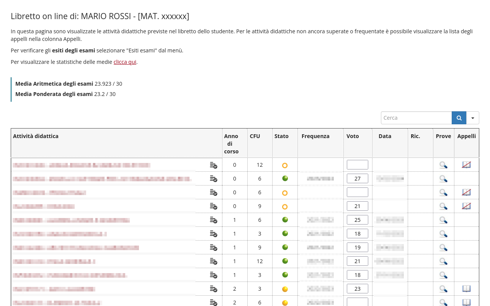
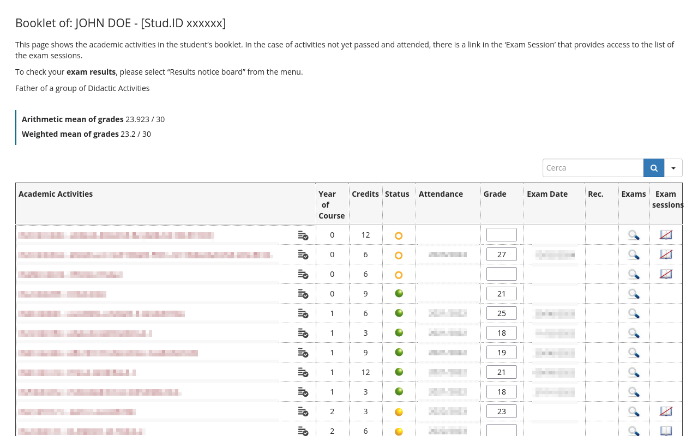

# Uniweb Enhancer
Questa estensione modifica l'interfaccia del [libretto in Uniweb](https://uniweb.unipd.it/auth/studente/Libretto/LibrettoHome.do): potrai simulare una modifica ai tuoi voti (anche per esami che devi ancora dare!) e potrai vedere la conseguente ripercussione sulle medie!
> Non preoccuparti: qualsiasi modifica ai voti verrà fatta esclusivamente nel tuo computer, i docenti non vedranno nulla e appena riaggiorni la pagina tutto ritornerà come prima!

This extension modifies the user interface of [Uniweb's booklet](https://uniweb.unipd.it/auth/studente/Libretto/LibrettoHome.do): you can change your grades (even for ungraded exams!) and simulate the new average!
> Don't worry: changes to your grades are only made on your computer, teachers won't see anything different, and when you refresh the page, everything will be as it was before.

## Installation

## Preview
<figure>
    
    <figcaption>Anteprima in italiano</figcaption>
</figure>

---

<figure>
    
    <figcaption>English Preview</figcaption>
</figure>

---

## Build instructions
1. Install `npm` (any recent version should be fine);
2. Open the terminal and navigate into the project folder;
3. Install Typescript running `npm install`;
4. Compile the extension into Javascript running `npm run build`.
The generated Javascript file will be in the project folder.

## How to contribute
If you are a developer and you want to contribute to the project, feel free to create issues and/or pull requests! And just in case, **leave a star**!